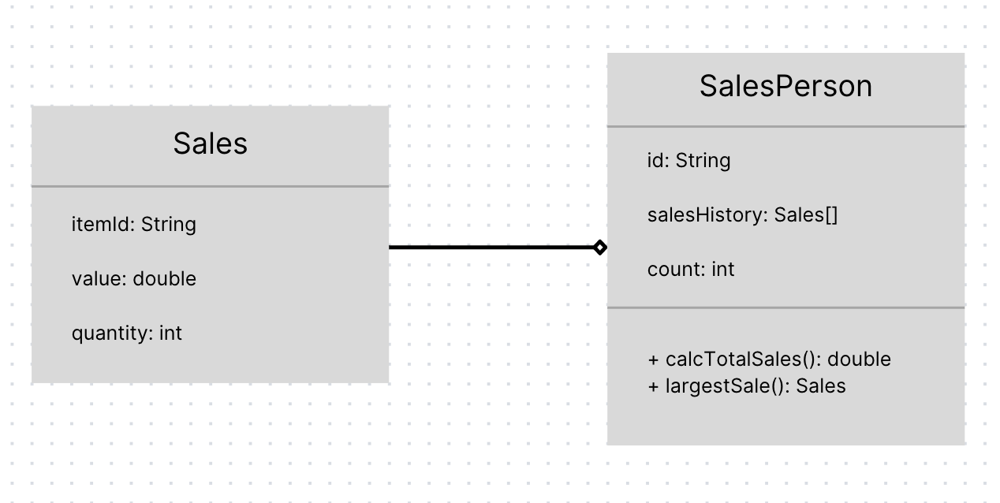

## Class Design and Implementation Case

### Brigitte Sharon Alexander - 2602119190

---

### 1.(a) By making use of an example from the above scenario, distinguish between a class and an instantiation of a class. (3 points)

#### A class describes a certain object while an instatiation provides the class for the object. For instance, an employee class consists of the description of an employee as an employee instatiation act as a certain employee.

#

### (b) By giving two examples, explain how the principles of inheritance can be incorporated into the design of this administration program. (4 points)

#### Firstly, a employee superclass that inherits different characteristics of employees can be implemented; the characteristics may include position, salary structure, and ID. Other than that, another superclass for the products can be implemented as well. It may contain properties like clothing, furniture, or electronics.

#

### (c) Describe how the use of libraries can facilitate the development of programs like this company’s administration program. (3 points)

#### With the use of libraries, it'll save time in development as libraries are programs that have already been written. As it has been used beforehand, it is trusted and is a reliable source.

---

### 2. The company employs several sales personnel to sell its products to different retailers. Each branch of the company keeps track of its own sales with a suite of programs that include the two classes SalesPerson and Sales.

#

### (a) Complete the constructor public SalesPerson(String id), from the SalesPerson class. (2 points)

```javascript
...
    public SalesPerson(String id) {
	this.id = id;
	this.salesHistory = new Sales[100];
    }
...
```
#

### (b) Explain why accessor methods are necessary for the SalesPerson class. (3 points)

#### The variables are private so they can't be declared outside of the class. So in order to access it, public accessor methods are required.

#

### (c) (i) Construct unified modelling language (UML) diagrams to clearly show the relationship between the SalesPerson and Sales classes.

Note: There is no need to include mutator or accessor methods or a constructor. (4 points)



#

### (c) (ii) Outline a negative effect that a future change in the design of the Sales object might have on this suite of programs. (2 points)

#### Any alteration to the Sales class will further make changes to the SalesPerson class as it is dependant on the Sales class. For instance, the calcTotalSales() and largestSale() methods require data from the Sales class and if anything changes from there, alterations need to be made to the SalesPerson class.

#

### (d) State the output after running this code. (4 points)

```
102
2
2550.40
5000.00
```

#

### (e) Construct the method calcTotalSales(), in the SalesPerson class that calculates the total value of the sales for a specific SalesPerson object. (5 points)

```javascript
...
    public double calcTotalSales() {
        double totalSales = 0;
        for (Sales sales : salesHistory) {
            if (sales == null) {
                break;
            }

            totalSales += sales.getValue() * sales.getQuantity();
        } 
        return totalSales;
    }
...
```

#

### (f) By making use of any previously written methods, construct the method highest(), that returns the ID of the salesperson whose sales have the largest total value. (5 points)

```javascript
... 
    public static String highest(SalesPerson[] salesPeople) {
    	String id = "";
    	double highest = salesPeople[0].calcTotalSales();

    	for (SalesPerson salesPerson : salesPeople) {
            if (salesPerson == null) {
           	break;
            }

       	    if (salesPerson.calcTotalSales() > highest) {
                highest = salesPerson.calcTotalSales();
                id = salesPerson.getId();
            }
        }

        return id;
    }
...
```

#

### (g) Construct the method addSales(Sales s, String id), in the Driver class, that will add a new Sales object s, to the salesperson with a specified ID.

### Note: You can assume that the ID is a valid one. (4 points)
```javascript
...
    public static void addSales(Sales s, String id) {
    	for (SalesPerson salesPerson : salesPeople) {
            if (salesPerson != null && salesPerson.getId().equals(id)) {
            	salesPerson.setSalesHistory(s);
            	return; 
            }
    	}
    }
...
```

#

### (h) Suggest changes that must be made to the SalesPerson class and/or the Sales class to allow these calculations to be made. (3 points)

#### A date variable should be added to the Sales class and a get/set method should be implement in order to get the date. 

#

### (i) Discuss the use of polymorphism that occurs in this suite of programs. (3 points)

#### Two constructors have the same name but different functions: SalesPerson(string id) and SalesPerson(String id, Sales [] s, int c).